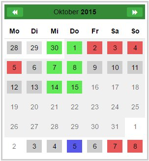

# MultiSelectionCalendar
`MultiSelectionCalendar` is a JavaScript calendar control for marking several date ranges and associate them to different selection groups.



## How To Install
[Download](https://github.com/Tommmi/MultiSelectionCalendar.git) the latest version of MultiSelectionCalendar from Github repository and copy the following JavaScript files and style sheets to your web project:
-   [{repository}\lib\jquery.mousewheel.min.js](lib/jquery.mousewheel.min.js) (third party [library](https://github.com/jquery/jquery-mousewheel))
-   [{repository}\lib\mscorlib.min.js](lib/mscorlib.min.js) (third party [library](https://github.com/Saltarelle/SaltarelleCompiler))
-   [{repository}\lib\linq.min.js](lib/linq.min.js) (third party [library](https://github.com/Saltarelle/SaltarelleLinq))
-   [{repository}\lib\MultiSelectionCalendarResource.js](lib/MultiSelectionCalendarResource.js)
-   optional: [{repository}\lib\MultiSelectionCalendarResource.en.js](lib/MultiSelectionCalendarResource.en.js)
-   optional: [{repository}\lib\MultiSelectionCalendarResource.es.js](lib/MultiSelectionCalendarResource.es.js)
-   [{repository}\lib\MultiSelectionCalendar.min.js](lib/MultiSelectionCalendar.min.js)
-   [{repository}\lib\MultiSelectionCalendar.less](lib/MultiSelectionCalendar.less)
-   optional: [{repository}\lib\MultiSelectionCalendar.css](lib/MultiSelectionCalendar.css)

## Usage
Insert an input tag of type text into your webpage and assign the CSS class "multiSelectionCalendar":
```html
<!DOCTYPE html>
<html>
<head>
    <link href="styles/bootstrap.css" rel="stylesheet" />
    <link href="styles/MultiSelectionCalendar.css" rel="stylesheet" />
</head>
<body>
    <input 
        type="text" 
        class="multiSelectionCalendar"         
        selectionIdx="2" />

    <script src="scripts/jquery-1.10.2.js"></script>
    <script src="scripts/bootstrap.js"></script>
    <script src="scripts/mscorlib.min.js"></script>
    <script src="scripts/linq.js"></script>
    <script src="scripts/saltarelle.utils.js"></script>
    <script src="scripts/multiselectioncalendarresource.js"></script>
    <script src="scripts/jquery.mousewheel.min.js"></script>
    <script src="scripts/multiselectioncalendar.js"></script>
</body>
</html>
```
You'll get a calendar showing the current month. No date ranges are preselected since attribute `value` wasn't set.
Now you can select single dates and date ranges, but these will be assigned only to selection index 2.
If you do so, the value of the input field will change automatically to some value like this:
```html
    <input 
        type="text" 
        class="hidden ng-untouched ng-valid ng-dirty ng-valid-parse" 
        selectionidx="2" 
        value="2:12.06.2016-20.06.2016;2:25.06.2016-25.06.2016" />
```
To change the selection color please change the attribute `selectionidx` to a natural number > 0. `selectionidx="0"` will erase marked dates, when they are being selected now ! Use this feature to let the user remove selections.

## Reference
```html
    <input type="text" class="multiSelectionCalendar" [selectionidx] [value] [enabledRanges] [language]/>
```
* `selectionidx`:  
    All dates, the user will select from now on, will be assigned to the given selection index.  
    `selectionidx="0"` will erase marked dates, when they are being selected now ! Use this feature to let the user
    remove selections.
    possible values: "0", "1", .., "9"   
    Default: "0"  
* `value`:  
    The date ranges which should be edited by the user. `value` will be updated automatically, when user selects dates.  
    example: "2:12.06.2016-20.06.2016;4:25.06.2016-25.06.2016"  
    Default: ""  
    Format: {selection index}:{start date}-{end date};{selection index}:{start date}-{end date};...
* `enabledRanges`:  
    The date ranges which may be markable by the user.   
    example: "12.06.2016-20.06.2016;25.06.2016-25.06.2016"  
    Default: ""  (means all dates are enabled)  
    Format: {start date}-{end date};{start date}-{end date};...
* `language`:  
    ISO code of the active language. Note ! The language dependent strings are coded in the files
    `MultiSelectionCalendarResource...js`. Feel free to add new languages.  
    example: "en"  
    Default: ""  :means default language (it's currently german)  
    Format: "en","de","es", "default",""

    
  


